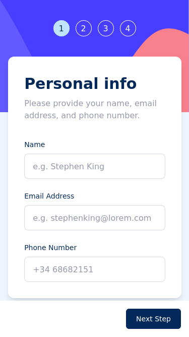

# Multi Step Form

My solution for the [Multi-step form challenge on Frontend Mentor](https://www.frontendmentor.io/challenges/multistep-form-YVAnSdqQBJ) using _React_.

- [Live Site](https://multi-step-form-gmaitor.vercel.app/)

## Table of contents

- [Overview](#overview)
  - [The challenge](#the-challenge)
  - [Screenshot](#screenshot)
  - [Links](#links)
- [My process](#my-process)
  - [Built with](#built-with)
  - [What I learned](#what-i-learned)
- [Author](#author)

## Overview

### The challenge

- Complete each step of the sequence
- Go back to a previous step to update their selections
- See a summary of their selections on the final step and confirm their order
- View the optimal layout for the interface depending on their device's screen size
- See hover and focus states for all interactive elements on the page
- Receive form validation messages if:
  - A field has been missed
  - The email address is not formatted correctly
  - A step is submitted, but no selection has been made

### Screenshot

<table>
        <tr>
            <td>
                
            </td>
		        <td>
                
            </td>
            <td>
                
            </td>
            </tr>
</table>

### Links

- Solution URL: [Add solution URL here](https://www.frontendmentor.io/solutions/multi-step-form-tailwindreactredux-BK-m2atIAj)
- Live Site URL: [https://multi-step-form-gmaitor.vercel.app/](https://multi-step-form-gmaitor.vercel.app/)

## My process

### Built with

- Semantic HTML5 markup
- [Tailwind](https://tailwindcss.com/) - CSS Framework
- [Sonner](https://sonner.emilkowal.ski/) - Toast Component Library
- [React](https://reactjs.org/) - Web Framework
- [React Router](https://reactrouter.com/en/main) - Client Side Routing Library
- [Redux Toolkit](https://redux-toolkit.js.org/) - State Management Library

### What I learned

This challenge has helped me to realise how vite with react is building assets. For images, if you are using them as _src/assets/images/*_ you need to import them, otherwise they wont be taken into dist folder, other work around is to add the images to the public folders so they will be added to de _/dist_ folder anyway. 

## Author

- Frontend Mentor - [@AitorGallardo](https://www.frontendmentor.io/profile/AitorGallardo)
